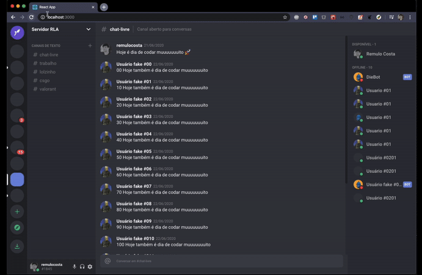

<h1 align="center">
 🚀 UI Clone Discord
</h1>

  

  

  

  

  

  <a href="#bibliotecas-e-tecnologias">Tecnologias</a>&nbsp;&nbsp;&nbsp;|&nbsp;&nbsp;&nbsp;
  <a href="#discord">Discord</a>&nbsp;&nbsp;&nbsp;|&nbsp;&nbsp;&nbsp;
  <a href="#instala">Instalação</a>&nbsp;&nbsp;&nbsp;|&nbsp;&nbsp;&nbsp;
  <a href="#memo-license">License</a>

  

## Discord

[Discord](https://discord.com/) é um aplicativo de voz sobre IP proprietário e gratuito, projetado para comunidades de jogos. O aplicativo Discord está disponível para os sistemas operacionais Microsoft Windows, macOS, Android, iOS, Linux e em navegadores da Web. Em dezembro de 2016, os desenvolvedores anunciaram que Discord tinha mais de 25 milhões de usuários. [Fonte wikipedia](https://pt.wikipedia.org/wiki/Discord)

## Bibliotecas e tecnologias

#### Principais tecnologias:

- React JS
- TypeScript

#### Bibliotecas:

- Styled Components
- Styled Icons

## Instalação

1. Instale o [Node.js](https://nodejs.org/en/) e o [Yarn](https://yarnpkg.com/).
1. Clone o projeto executando este comando: `git clone https://github.com/remulocosta/ui-clone-discord.git`
1. Vá para a pasta do projeto e execute `yarn install` para instalar dependências.
1. Execute `yarn start`

## :memo: License

This project uses the MIT license. Read [LICENSE](LICENSE.md) for details.

---

Made with ♥ by Remulo Costa :wave:
